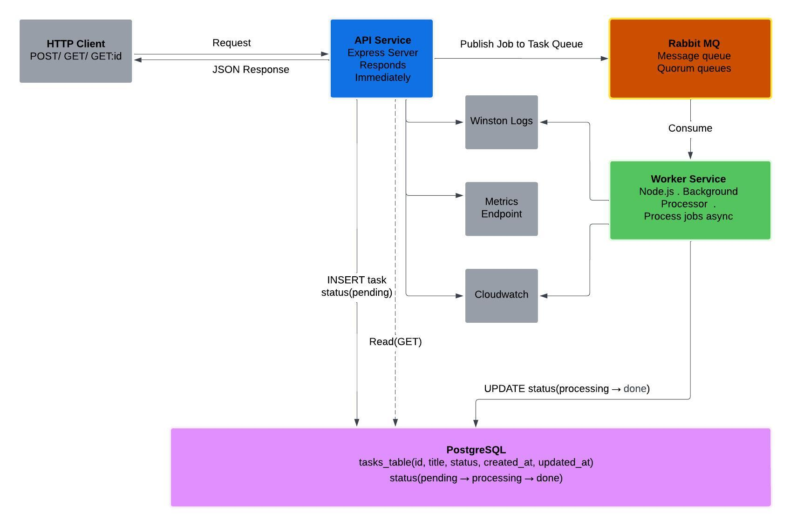
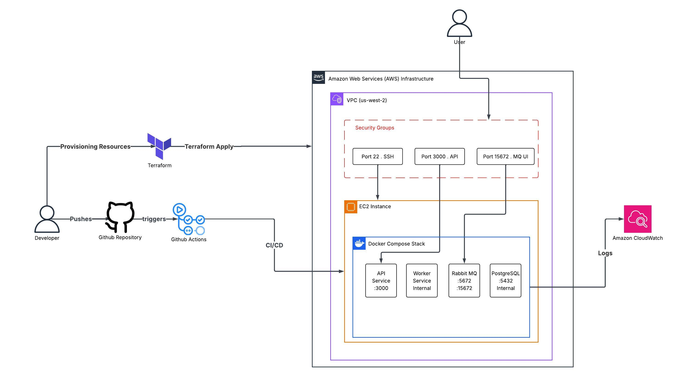

# Taskflow

A distributed task processing system built with a microservices architecture. Demonstrates asynchronous job processing, message queuing, containerization, cloud deployment, and CI/CD automation.

## What it is

Taskflow is a two-service backend system that separates HTTP request handling from background processing. When a task is created via the API, it is published to a message queue and processed asynchronously by a worker service. This mirrors real-world patterns used in order processing, notification, and job queue systems.

## Architecture

```
HTTP Client
     │
     ▼
API Service (Node.js)
     │
     ├──── PostgreSQL (stores tasks + status)
     │
     └──── RabbitMQ (publishes job)
                │
                ▼
         Worker Service (Node.js)
                │
                └──── PostgreSQL (updates status: pending → processing → done)
```

All services run as Docker containers on AWS EC2, provisioned with Terraform and deployed automatically via GitHub Actions.

## Tech Stack

| Layer | Technology |
|-------|-----------|
| API Service | Node.js, Express |
| Worker Service | Node.js |
| Message Queue | RabbitMQ (quorum queues) |
| Database | PostgreSQL |
| Logging | Winston (structured JSON logs) |
| Containerization | Docker, Docker Compose |
| Infrastructure | AWS EC2, Terraform |
| CI/CD | GitHub Actions |
| Observability | CloudWatch, /metrics endpoint, structured logs |

## API Endpoints

| Method | Endpoint | Description |
|--------|----------|-------------|
| POST | `/` | Create a task |
| GET | `/` | Get all tasks |
| GET | `/:id` | Get a task by ID |
| GET | `/metrics` | Get task counts by status |

**Creating a task with Postman:**

Send a POST request to `http://<PUBLIC_IP>:3000` with the following JSON body:

```json
{
  "title": "my task"
}
```

**Response:**

```json
{
  "id": 1,
  "title": "my task",
  "status": "pending",
  "created_at": "2026-04-27T10:00:00.000Z",
  "updated_at": "2026-04-27T10:00:00.000Z"
}
```

The worker picks up the job and updates the status: `pending → processing → done`.

## CI/CD Pipeline

Every push to `main` triggers a GitHub Actions workflow that:

1. SSHs into the EC2 instance
2. Pulls the latest code from GitHub
3. Rebuilds Docker images
4. Restarts the stack

Secrets stored in GitHub: `EC2_HOST`, `EC2_USER`, `EC2_SSH_KEY`.

## Observability

- **Structured logs** — Winston emits JSON logs with `task_id`, `title`, `duration_ms`, and `error` fields
- **Metrics endpoint** — `GET /metrics` returns live counts of tasks by status
- **CloudWatch** — both containers ship logs to the `taskflow` log group in AWS CloudWatch via the `awslogs` Docker driver

## Design Diagrams

### Architecture Diagram

<table>
  <tr>
    <td colspan="2" align="center"></td>
  </tr>
</table>

### Infrastructure Diagram

<table>
  <tr>
    <td colspan="2" align="center"></td>
  </tr>
</table>

## Deploy Your Own

This section walks you through deploying Taskflow to your own AWS account from scratch. You will need: an AWS account, Terraform installed, the AWS CLI installed and configured, and an SSH key pair.

### 1. Prerequisites

Install and configure the AWS CLI:

```bash
aws configure
```

You will be prompted for your AWS Access Key ID, Secret Access Key, default region (e.g. `us-east-1`), and output format (`json`). You can generate access keys from the AWS Console under your account name → Security Credentials → Access Keys.

Generate an SSH key pair if you don't have one already:

```bash
ssh-keygen -t rsa -b 4096 -f ~/.ssh/taskflow-key
```

Press enter twice for no passphrase. This creates `taskflow-key` (private) and `taskflow-key.pub` (public) in `~/.ssh/`.

### 2. Provision Infrastructure with Terraform

Clone the repository and navigate to the terraform folder:

```bash
git clone https://github.com/KRC00112/Taskflow.git
cd Taskflow/terraform
```

Initialize Terraform and apply:

```bash
terraform init
terraform apply
```

Terraform will create:

- An EC2 `t3.micro` instance running Ubuntu 24.04
- A security group opening ports 22 (SSH), 3000 (API), and 15672 (RabbitMQ management UI)
- An SSH key pair using your `~/.ssh/taskflow-key.pub`
- Docker and Docker Compose installed on the instance automatically via `user_data`
- The Taskflow repo cloned automatically on the instance

When `terraform apply` completes it will print the public IP of your instance:

```
Outputs:
public_ip = "x.x.x.x"
```

Save this IP. You will need it in the next steps.

### 3. Configure Environment Variables on the Server

Wait 1-2 minutes after provisioning for the instance to finish booting, then SSH in:

```bash
ssh -i ~/.ssh/taskflow-key ubuntu@<YOUR_PUBLIC_IP>
```

The repo is already cloned at `/home/ubuntu/Taskflow` by the `user_data` script. Navigate into it:

```bash
cd /home/ubuntu/Taskflow
```

Create environment files for each service:

```bash
cat > api-service/.env << EOF
DB_USER=postgres
DB_HOST=postgres
DB_NAME=taskflowdb
DB_PASSWORD=yourpassword
DB_PORT=5432
EOF
```

```bash
cat > worker-service/.env << EOF
DB_USER=postgres
DB_HOST=postgres
DB_NAME=taskflowdb
DB_PASSWORD=yourpassword
DB_PORT=5432
EOF
```

Replace `yourpassword` with a password of your choice. Make sure `DB_HOST` is set to `postgres` (the Docker Compose service name), not `localhost`.

### 4. Start the Stack

From the repo root on the server:

```bash
docker-compose up --build -d
```

This starts RabbitMQ, PostgreSQL, the API service, and the worker service as containers. Verify everything is running:

```bash
docker-compose ps
```

### 5. Create the Database Table

```bash
docker-compose exec postgres psql -U postgres -d taskflowdb -c "CREATE TABLE tasks (id SERIAL PRIMARY KEY, title VARCHAR(255) NOT NULL, status VARCHAR(50) DEFAULT 'pending', created_at TIMESTAMP DEFAULT NOW(), updated_at TIMESTAMP DEFAULT NOW());"
```

Your API is now publicly reachable at `http://<YOUR_PUBLIC_IP>:3000`.

### 6. Set Up CI/CD

To enable automatic deployment on every push to `main`, add the following secrets to your GitHub repository under Settings → Secrets and variables → Actions:

| Secret | Value |
|--------|-------|
| `EC2_HOST` | Your EC2 public IP |
| `EC2_USER` | `ubuntu` |
| `EC2_SSH_KEY` | Contents of your `~/.ssh/taskflow-key` private key file |

Once set, every push to `main` will SSH into your EC2 instance, pull the latest code, rebuild the images, and restart the stack automatically. You will not need to SSH in again to apply updates.

### 7. View the RabbitMQ Dashboard

Open `http://<YOUR_PUBLIC_IP>:15672` in your browser. Log in with `guest` / `guest`. You can monitor queues, message rates, and connections here.

### 8. Tear Down

To destroy all AWS resources created by Terraform and stop incurring charges:

```bash
cd terraform
terraform destroy
```

## Design Decisions

**Separating API and Worker services**

The API can respond immediately without waiting for processing to complete. If the worker is slow or crashes, the API stays unaffected. This is the foundation of any resilient backend system.

**Choosing RabbitMQ over direct HTTP calls between services**

Direct HTTP between services creates tight coupling. If the worker is down, the API fails too. RabbitMQ acts as a buffer: jobs queue up and are processed when the worker is ready. Quorum queues ensure no jobs are lost even if RabbitMQ restarts.

**Docker Compose over Kubernetes**

Kubernetes adds significant operational overhead that isn't justified for a two-service system. Docker Compose keeps the deployment simple and reproducible while still demonstrating containerization and multi-service orchestration.

**Terraform over manual AWS setup**

Infrastructure as code means the entire AWS setup can be recreated from scratch with one command. No clicking through consoles, no undocumented manual steps.
